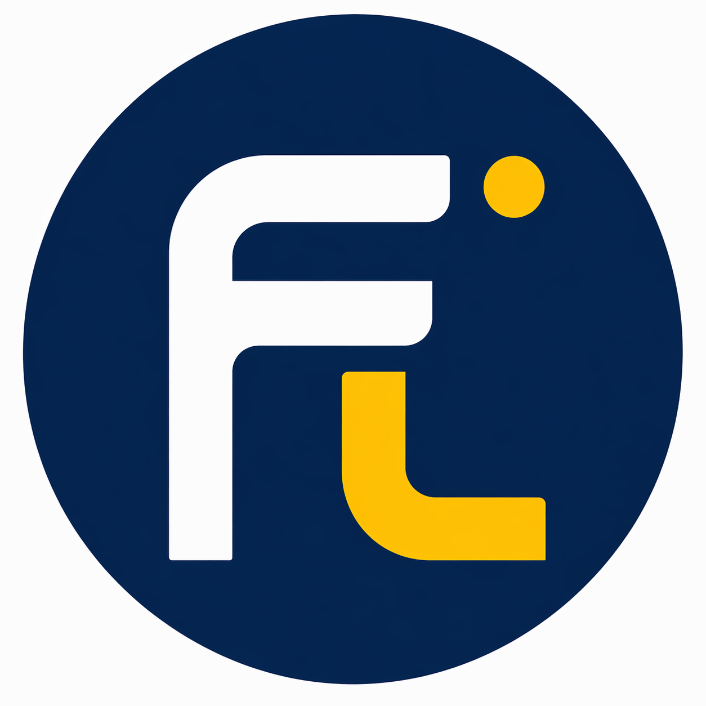
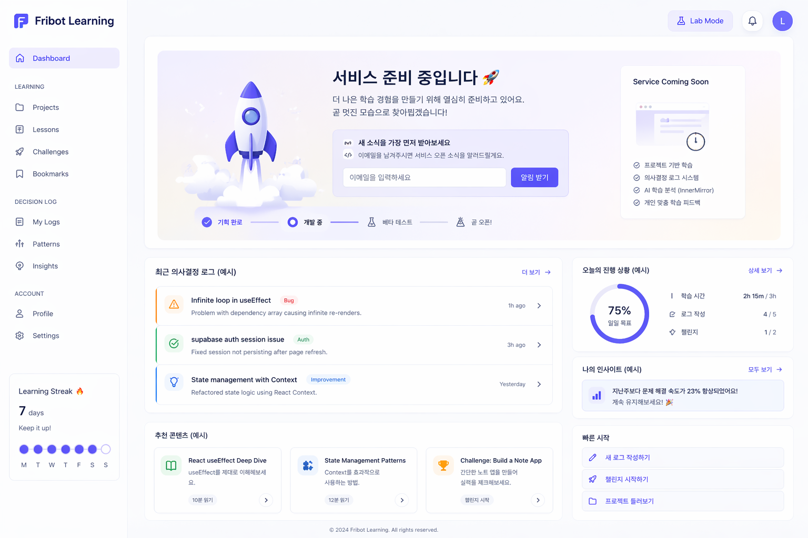

<p align="center">
  
</p>

<h1 align="center">Fribot Learning</h1>

<p align="center">
  Learn coding. Track your thinking. Build real skills.
</p>

<p align="center">
  <a href="https://lab.fribot.com">
    
  </a>
</p>

<p align="center">
  <b>👉 Click and start your first decision log</b>
</p>

<p align="center">
  <sub>No signup required • Start instantly</sub>
</p>

---

## 🧠 What is Fribot Learning?

Fribot Learning is a **project-based coding learning system**  
combined with a **decision logging method**.

You don’t just learn code.  
You learn how to:

- think through problems  
- make decisions  
- improve your reasoning  

---

## ⚡ Why this is different

Most coding education teaches:

- syntax  
- tutorials  
- copy & paste  

But real growth comes from:

👉 **understanding your own thinking**

---

## 🔁 Learning Loop

```
Learn → Get Stuck → Record → Reflect → Improve
```


This is the core of real growth.

---

## 🪞 Decision Logging (핵심 개념)

When you get stuck, you record:

- What you tried  
- What failed  
- What you think is wrong  
- What you will try next  

### Example

```
Goal: Understand loop logic
Problem: Infinite loop
Judgment: Condition not updating
Next: Modify variable inside loop
```

---

## 🖥️ See How It Works

Experience the actual learning + decision tracking flow:

<p align="center">
  
</p>

👉 **https://lab.fribot.com**

---

## 🧩 System Architecture

- Learning (Projects)
- Decision Logging
- Reflection
- Pattern Analysis *(InnerMirror)*

---

## 🔍 Philosophy

> Learning is not consuming knowledge.  
> Learning is evolving your decisions.

---

## 🛠️ Tech (internal)

- React / TypeScript  
- Supabase  
- Fastify  

---

## 🚧 Status

Early stage (MVP)

We are building:

- real learning flow  
- decision-based feedback system  
- AI-assisted thinking improvement  

---

## 📩 Contact

- 🌐 https://lab.fribot.com  
- 📧 mail@fribot.com  
